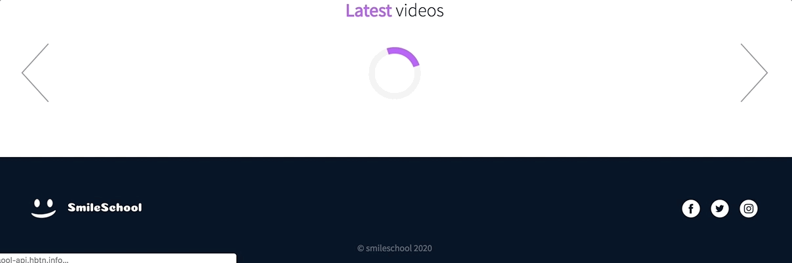

# Holberton SmileSchool Javascript

## Description

Implement 3 web pages with Bootstrap and javascript (jQuery)

### [Reuse and polish your Bootstrap integration](./0-homepage.html)

### [Homepage - quotes](./1-homepage.html)

**Final result:**

### [Homepage - popular tutorials](./2-homepage.html)

**Final result:**

### [Homepage - latest videos](./homepage.html)

**Final result:**

### [Pricing - quotes](./pricing.html)

### [Courses](./courses.html)

### [JSON to XML](./xml-scripts.js)

* Convert all your JSON Ajax call to another API… a XML API!

---

## Author

**Oscar Andres Montes** - [andmontc](https://github.com/andmontc)
